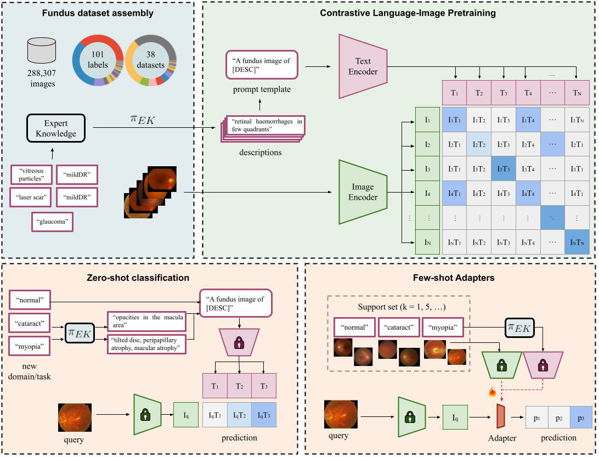

## FLAIR: A Foundation LAnguage Image model of the Retina

 <br/>

<b>A Foundation LAnguage Image model of the Retina (FLAIR):</b> <br/>
<b>Encoding expert knowledge in text supervision</b> <br/>
📜 <span style="color:red">*Published in Medical Image Analysis*</span> \
[Julio Silva-Rodríguez<sup>1</sup>](https://scholar.google.es/citations?user=1UMYgHMAAAAJ&hl),
[Hadi Chakor<sup>2</sup>](https://scholar.google.ca/citations?user=0Njg-cQAAAAJ&hl),
[Riadh Kobbi<sup>2</sup>](https://ca.linkedin.com/in/riadh-kobbi),
[Jose Dolz<sup>1</sup>](https://scholar.google.es/citations?user=yHQIFFMAAAAJ&hl),
[Ismail Ben Ayed<sup>1</sup>](https://scholar.google.es/citations?user=29vyUccAAAAJ&hl) <br/>
[<sup>1</sup>ÉTS Montréal](https://www.etsmtl.ca/), [<sup>2</sup>DIAGNOS  Inc.](https://www.diagnos.com/)<br/>
| [Project](https://jusiro.github.io/projects/flair) | [Journal](https://www.sciencedirect.com/science/article/pii/S1361841524002822) | [ArXiv](https://arxiv.org/pdf/2308.07898.pdf) | [Code](https://github.com/jusiro/FLAIR) | [Tutorials](https://colab.research.google.com/drive/1LE50MQmsEQxMM-qvytXGeJ9WAu09w1MR?usp=sharing) |

## Install FLAIR

* Install in your enviroment a compatible torch version with your GPU. For example:
```
conda create -n flair_env python=3.11 -y
conda activate flair_env
conda install pytorch==2.0.1 torchvision==0.15.2 torchaudio==2.0.2 pytorch-cuda=11.7 -c pytorch -c nvidia
```

* Install FLAIR library.
```
pip install git+https://github.com/jusiro/FLAIR.git
```

## Usage

```
from PIL import Image
import numpy as np

# Import FLAIR
from flair import FLAIRModel

# Set model
model = FLAIRModel(from_checkpoint=True)

# Load image and set target categories 
# (if the repo is not cloned, download the image and change the path!)

image = np.array(Image.open("./documents/sample_macular_hole.png"))
text = ["normal", "healthy", "macular edema", "diabetic retinopathy", "glaucoma", "macular hole",
        "lesion", "lesion in the macula"]

# Forward FLAIR model to compute similarities
probs, logits = model(image, text)

print("Image-Text similarities:")
print(logits.round(3)) # [[-0.32  -2.782  3.164  4.388  5.919  6.639  6.579 10.478]]
print("Probabilities:")
print(probs.round(3))  # [[0.      0.     0.001  0.002  0.01   0.02   0.019  0.948]]
```

## **Note**: problems during automatic **pre-trained weights download**

If you encounter any issue while downloading the **pre-trained weights** (i.e. `from_checkpoint=True`), you can manually download the weights from the following links (see Table), unzip the file, and store them at: `./flair/modeling/flair_pretrained_weights/[ID].pth`.

| Backbone  |      ID      |                                                                                               |
|-----------|:------------:|:---------------------------------------------------------------------------------------------:|
| ResNet-50 | flair_resnet | [LINK](https://drive.google.com/file/d/1l24_2IzwQdnaa034I0zcyDLs_zMujsbR/view?usp=drive_link) |

## Pre-training and transferability

In the following, we present the scripts for model pre-training and transferability. To use them, we recommend cloning the whole repository.

```
git clone https://github.com/jusiro/FLAIR.git
cd FLAIR
pip install -r requirements.txt
```

### 📦 Foundation model pre-training

* Define the relative paths for datasets and dataframes in `./local_data/constants.py`.

* Prepare the FUNDUS assembly dataset - check `./local_data/prepare_partitions.py` to prepare the dataframes.

|                                                                                                                                      |                                                                                                                           |                                                                                        |                                                                             |                                                                                                                                                                  |                                                                                                         |
|--------------------------------------------------------------------------------------------------------------------------------------|---------------------------------------------------------------------------------------------------------------------------|----------------------------------------------------------------------------------------|-----------------------------------------------------------------------------|------------------------------------------------------------------------------------------------------------------------------------------------------------------|---------------------------------------------------------------------------------------------------------|
| [01_EYEPACS](https://www.kaggle.com/c/diabetic-retinopathy-detection/data)                                                           | [08_ODIR-5K](https://www.kaggle.com/datasets/andrewmvd/ocular-disease-recognition-odir5k)                                 | [15_APTOS](https://www.kaggle.com/competitions/aptos2019-blindness-detection/data)     | [22_HEI-MED](https://github.com/lgiancaUTH/HEI-MED)                         | [29_AIROGS](https://zenodo.org/record/5793241#.ZDi2vNLMJH5)                                                                                                      | [36_ACRIMA](https://biomedical-engineering-online.biomedcentral.com/articles/10.1186/s12938-019-0649-y) |
| [02_MESIDOR](https://www.adcis.net/en/third-party/messidor2/)                                                                        | [09_PAPILA](https://figshare.com/articles/dataset/PAPILA/14798004/1)                                                      | [16_FUND-OCT](https://data.mendeley.com/datasets/trghs22fpg/3)                         | [23_HRF](http://www5.cs.fau.de/research/data/fundus-images/)                | [30_SUSTech-SYSU](https://figshare.com/articles/dataset/The_SUSTech-SYSU_dataset_for_automated_exudate_detection_and_diabetic_retinopathy_grading/12570770/1)    | [37_DeepDRiD](https://github.com/deepdrdoc/DeepDRiD)                                                    |
| [03_IDRID](https://idrid.grand-challenge.org/Rules/)                                                                                 | [10_PARAGUAY](https://zenodo.org/record/4647952#.ZBT5xXbMJD9)                                                             | [17_DiaRetDB1](https://www.it.lut.fi/project/imageret/diaretdb1_v2_1/)                 | [24_ORIGA](https://pubmed.ncbi.nlm.nih.gov/21095735/)                       | [31_JICHI](https://figshare.com/articles/figure/Davis_Grading_of_One_and_Concatenated_Figures/4879853/1)                                                         | [38_MMAC](https://codalab.lisn.upsaclay.fr/competitions/12441)                                          |
| [04_RFMid](https://ieee-dataport.org/documents/retinal-fundus-multi-disease-image-dataset-rfmid-20)                                  | [11_STARE](https://cecas.clemson.edu/~ahoover/stare/)                                                                     | [18_DRIONS-DB](http://www.ia.uned.es/~ejcarmona/DRIONS-DB.html)                        | [25_REFUGE](https://refuge.grand-challenge.org/)                            | [32_CHAKSU](https://figshare.com/articles/dataset/Ch_k_u_A_glaucoma_specific_fundus_image_database/20123135?file=38944805)                                       |                                                                                                         |
| [05_1000x39](https://www.kaggle.com/datasets/linchundan/fundusimage1000)                                                             | [12_ARIA](https://www.researchgate.net/post/How_can_I_find_the_ARIA_Automatic_Retinal_Image_Analysis_Dataset)             | [19_Drishti-GS1](http://cvit.iiit.ac.in/projects/mip/drishti-gs/mip-dataset2/Home.php) | [26_ROC](http://webeye.ophth.uiowa.edu/ROC/)                                | [33_DR1-2](https://figshare.com/articles/dataset/Advancing_Bag_of_Visual_Words_Representations_for_Lesion_Classification_in_Retinal_Images/953671?file=6502302)  |                                                                                                         |
| [06_DEN](https://github.com/Jhhuangkay/DeepOpht-Medical-Report-Generation-for-Retinal-Images-via-Deep-Models-and-Visual-Explanation) | [13_FIVES](https://figshare.com/articles/figure/FIVES_A_Fundus_Image_Dataset_for_AI-based_Vessel_Segmentation/19688169/1) | [20_E-ophta](https://www.adcis.net/en/third-party/e-ophtha/)                           | [27_BRSET](https://physionet.org/content/brazilian-ophthalmological/1.0.0/) | [34_Cataract](https://www.kaggle.com/datasets/jr2ngb/cataractdataset)                                                                                            |                                                                                                         |
| [07_LAG](https://github.com/smilell/AG-CNN)                                                                                          | [14_AGAR300](https://ieee-dataport.org/open-access/diabetic-retinopathy-fundus-image-datasetagar300)                      | [21_G1020](https://arxiv.org/abs/2006.09158)                                           | [28_OIA-DDR](https://github.com/nkicsl/DDR-dataset)                         | [35_ScarDat](https://github.com/li-xirong/fundus10k)                                                                                                             |                                                                                                         |

**⚠️ (26/04/25)**: <u>Please be careful with the links</u>! These are open-access repositories, and <u>some datasets are not maintained by the original authors. Links may change, or contain malware</u>. I will try to keep the links updated, but I can't check them too often :). You may want to open an Issue, and I will check the problem as soon as possible.

* Vision-Language Pre-training.

```
python main_pretrain.py --augment_description True --balance True --epochs 15 --batch_size 128 --num_workers 6
```

### 📦 Transferability to downstream tasks/domains
* Define the relative paths for datasets and dataframes in `./local_data/constants.py`.
* Prepare the experiment setting for the target dataset - we used `./local_data/experiments.py` to store them.

```
if experiment == "02_MESSIDOR":
    setting = {"dataframe": PATH_DATAFRAME_TRANSFERABILITY_CLASSIFICATION + "02_MESSIDOR.csv",
               "task": "classification",
               "targets": {"no diabetic retinopathy": 0,
                           "mild diabetic retinopathy": 1,
                           "moderate diabetic retinopathy": 2,
                           "severe diabetic retinopathy": 3,
                           "proliferative diabetic retinopathy": 4}}
```

* Zero-shot (no adaptation).

```
python main_transferability.py --experiment 02_MESSIDOR --method zero_shot --load_weights True --domain_knowledge True  --shots_train 0% --shots_test 100% --project_features True --norm_features True --folds 1 
```

* Linear Probing.

```
python main_transferability.py --experiment 02_MESSIDOR --method lp --load_weights True --shots_train 80% --shots_test 20% --project_features False --norm_features False --folds 5 
```

# Citation

If you find this repository useful, please consider citing this paper:
```
@article{FLAIR,
    title = {A Foundation Language-Image Model of the Retina (FLAIR): encoding expert knowledge in text supervision},
    author = {Julio Silva-Rodríguez and Hadi Chakor and Riadh Kobbi and Jose Dolz and Ismail {Ben Ayed}},
    journal = {Medical Image Analysis},
    volume = {99},
    pages = {103357},
    year = {2025},
    issn = {1361-8415},
}
```

# License

- **Code and Model Weights** are released under [Apache 2.0 license](LICENSE)
